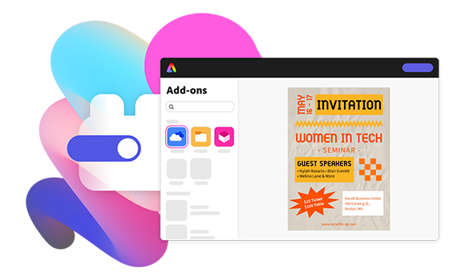

<TextBlock slots="image, heading, text" width="25%" theme="light" className="cardList" />

### Eliminate repetitive tasks 

From removing backgrounds to layyout adjustments, automate production tasks that slow down the creation of high-quality work.

<TextBlock slots="image, heading, text" width="25%"  theme="light" className="cardList" />

### Produce unlimited variations 

Combine a range of editing actions together into a creative task, enabling you to generate thousands of unique variations of your projects.

<TextBlock slots="image, heading, text" width="25%"  theme="light" className="cardList" />

### Incorporate into any workflow 

Creative APIs give you direct access to powerful generative AI capabilities that work seamlessly with the creative apps you already use.

<TextBlock slots="image, heading, text" width="25%"  theme="light" className="cardList" />

### Maintain quality control 

You trust Creative Cloud for creating your work. Firefly Service connect to the same Adobe technologies to help you create high-quality work even faster.
