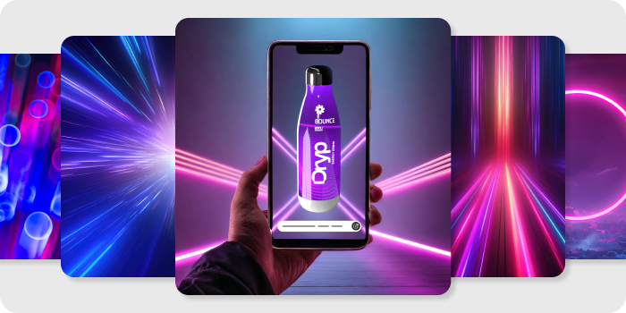

---
keywords:
  - Adobe Firefly
  - Firefly Services
  - Enterprise
  - Firefly API
  - Photoshop API
  - Content Tagging API
  - Lightroom API
  - Content Tagging
  - Lightroom
  - Photoshop
  - Firefly
  - Text to image
  - Style reference
  - Generative expand
  - Generative fill
  - Create mask
  - Generative AI
  - Remove background
  - Automate creative workflow
  - Localize campaigns and assets
  - Personalize and assets
  - Accelerate digital merchandising
  - Reduce costs of photo shoots
  - On-brand generative experiences
  - Product crop
  - Photoshop actions
  - Smart Crop
  - Depth Blur
  - Auto Straighten
  - Auto Tone
  - Apply Lightroom Presets
  - Apply Lightroom Edits
  - Add XMP to Image
  - Run Photoshop Actions
  - Replace Smart Objects
  - Create PSD
  - Apply Photoshop Edits
  - Edit Text layers
  - Create artboards
  - Create renditions
  - SDK
title: Adobe Firefly Services
description: Adobe Firefly Services is a comprehensive set of generative AI and creative APIs.
contributors:
  - https://github.com/amandahuarng
---

import "../styles/main.css";
import APIS from "./APIS.md";
import MobileAPIS from "./MobileAPIs.md";
import Cards from "./Cards.md";
import Service from "./Services.md";
import MediaComp from "./Media.md";
import heroVideo from "../videos/Hero-Video-FF-ADLS.mp4";
import bodyVideo from "../videos/ado_5727_firefly_UC3_MASTER_ProRes_20240322c_reduced.mp4";

<Hero slots="heading, text, buttons" variant="halfwidth" videoUrl={heroVideo} className="fireflyService-hero" />

## Accelerate content production with the power of AI

Firefly Services is a comprehensive set of generative AI and creative services that automates workflows. Quickly scale a few hero assets into thousands of renditions. Generate, edit and assemble images to enable personalized marketing for different customer segments, channels and regions.

- [Contact Us](faas.md)
- [View documentation](https://developer.adobe.com/firefly-services/docs)

<TextBlock slots="icons, image, heading, text" theme="lightest" className="comingsoonBlock"/>

### Quickly localize marketing videos

Reach a wider audience, in less time, with our AI-powered Dubbing and Lip Sync Services. Translate spoken dialogue into multiple languages while maintaining the sound of your voice with matching lip sync. Available via API or intuitive web app, Dubbing and Lip Sync is ideal for scaling the translation of promotional videos, product overviews, and more.

<TitleBlock slots="heading, text" className="fireflyAnnouncement anouncement-card-header" />

### Automate your workflows with Firefly Services.

Tap into the power of 20+ generative and creative APls and capabilities designed to drive content for modern marketing at scale.

<WrapperComponent slots="content" repeat="1" className="cardsWrapper" />

<Cards />

<TextBlock slots="heading" className="fireflyAnnouncement" theme="light"/>

### See Firefly Services in action

<WrapperComponent slots="content" repeat="1" theme="light" className="media" />

<MediaComp />

<TitleBlock slots="heading, text" className="fireflyAnnouncement creative-cloud-apiWays" theme="lightest"/>

### Streamline asset production and generate variations at scale.

See how both creative and marketing teams can work faster and smarter with Firefly Services.

<TextBlock slots="image, heading, text" className="campaigns" />

### Localize campaigns and assets.

Scale content production of geo-specific asset variants for campaigns and experiences. Generate imagery and assemble with other relevant content to create market-specific renditions.

<TextBlock slots="heading, text, image" className="campaigns" />

### Personalize campaigns and assets.

Keep up with ever-increasing personalization demands. Create imagery that's relevant to target audiences and scale production for multiple channels.

<TextBlock slots="image, heading, text" className="campaigns" />

### Produce and refresh product content for eCommerce.

Create repeatable workflows that stage products in different scenes to drive engagement. Automate the refresh of composite images for seasonal messages, promotions, and more.

<TextBlock slots="heading, text , image" className="campaigns" />

### Streamline bulk production.

Meet brand and quality standards for digital assets without taxing creative teams. Scale production of images by offloading repetitive, routine tasks to Firefly Services — available as a user-friendly web app (beta) for creative teams and an API for integration into any workflow.

<TextBlock slots="image, heading, text" className="campaigns last_campaigns" />

### Delight consumers with individualized experiences.

Empower consumers to create and interact with personalized content and experiences that foster brand affinity and loyalty.

<TextBlock slots="heading" className="fireflyAnnouncement" theme="light"/>

### The power of Firefly, Photoshop and more, in a single API collection

<Carousel slots="image, heading, text" repeat="8"  theme="light" className="carousel"  />

#### Text to Image

Generate images from text prompts using the Text to Image API, powered by Adobe Firefly.

#### Generative Expand

Use Generative Expand API to extend images to different format dimensions using Adobe Firefly’s outpainting capability.

 

#### Generative Fill

Add or replace content from images using the Generative Fill API, powered by Adobe Firefly. Combine with Create Mask or Remove Background APIs to easily create new compositions.

#### Style Reference

Create images at scale that share a consistent style and feel. Our text to image API can take a style reference image and apply it to your prompt input.

#### Remove Background

Experience flawless cutouts with our Remove Background API powered by cutting-edge neural network technology and AI advancements in Photoshop.

#### Photoshop Actions

Maximize efficiency and scale content production with Photoshop Actions. Record a series of Photoshop tasks and apply them to input files in bulk, saving valuable time.

#### Product Crop

Unlock the power of our Product Crop API, powered by Adobe Photoshop technology. Achieve pixel perfect imaging editing at scale.

#### Create mask

Leverage Adobe Photoshop’s AI/ML-powered Create Mask API to accurately identify image subjects and produce grayscale masks, simplifying background replacement.

<WrapperComponent slots="content" repeat="1" theme="light" className="wrapperForDisplayListItems" />

<APIS />

<WrapperComponent slots="content" repeat="1" theme="light" className="mobileWrapper" />

<MobileAPIS />

<WrapperComponent slots="content" repeat="1" theme="lightest" className="miniproductListWrapper" />

<Service />

<TextBlock slots="heading, text, image" className="designedForDevlopers" />

### Designed for Developers

Increase speed to market, reduce costs, and drive customer engagement and revenue by using Firefly Services in your workflows. Our specialized APIs are crafted to simplify and streamline batch and production processes. On top of that, we provide a SDK to make it easier to consume these services in the language of your choice.

<TextBlock slots="heading, buttons" className="fireflyAnnouncement contactUs" theme="light"/>

### Contact your Adobe Enterprise Account Executive to learn more

- [Contact Us](faas.md)
