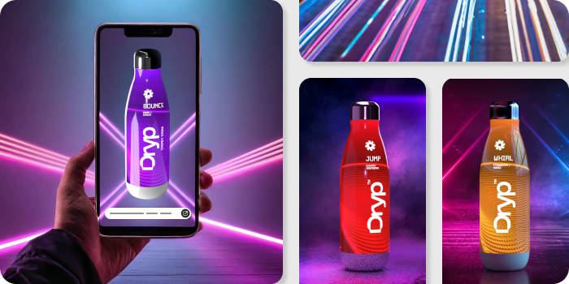

import "../styles/main.css";
import APIS from "./APIS.md";
import MobileAPIS from "./MobileAPIs.md";
import Cards from "./Cards.md";
import Service from "./Services.md";
import heroVideo from "../videos/HeroVideo.mp4";

<Hero slots="heading, text, buttons" variant="halfwidth" videoUrl={heroVideo} className="fireflyService-hero" />

## Boost content production with the power of AI

Firefly Services is a comprehensive set of generative AI and creative APIs that streamline workflows.  Quickly scale a few hero assets into thousands of renditions to enable personalized marketing for different customer segments, channels and regions.

- [Learn more](https://developer-stage.adobe.com/firefly-services/docs)

<TextBlock slots="heading" className="fireflyAnnouncement" theme="light"/>

### Transform and scale your workflows using our cutting-edge generative AI and creative APIs

<WrapperComponent slots="content" repeat="1" theme="light" className="cardsWrapper" />

<Cards />

<TextBlock slots="heading" className="fireflyAnnouncement creative-cloud-apiWays" theme="lightest"/>

### Unlock new ways of working with Firefly Services

<TextBlock slots="image, heading, text" className="campaigns" />

### Localize Campaigns and Assets

Scale content production of geo-specific asset variants for global campaigns and experiences. With Firefly Services, you can quickly generate market specific imagery and combine with other relevant content.
  
<TextBlock slots="heading, text , image" className="campaigns" />

### Personalize Campaigns and Assets

Keep up with ever-increasing personalization demands with Firefly Services, powered by generative AI. Quickly create imagery that’s relevant to target audiences and then scale production for multiple channels

<TextBlock slots="image, heading, text" className="campaigns" />

### Accelerate Digital Merchandising

Firefly Services help you create repeatable workflows to quickly generate variations of product shots or refresh composite images for seasonal messages, promotions, and more.

<TextBlock slots="heading, text , image" className="campaigns" />

### Reduce Costs of Photo Shoots & Post-Production

Ensure all your digital imagery meets brand standards without taxing creative teams.  Firefly Service can manage the repetitive routine tasks.

<TextBlock slots="image, heading, text" className="campaigns last_campaigns" />

### Engage Customers with On-Brand Generative Experiences

Open up the possibility for customers to create unique digital experiences to drive brand affinity and loyalty using Firefly Services.

<Carousel slots="image, heading, text" repeat="8"  theme="light" className="carousel"  />

#### Actions

Change the size of an image, apply an effect, then save an image all in one API call. Automate entire workflows in the cloud using Adobe Photoshop's Actions API.

#### Create mask

Powered by Adobe Photoshop, the Create Mask API identifies the main subject of an image and creates a greyscale mask that you can composite onto other backgrounds.

#### Generative Expand

Expand images with generative content using the Generative Expand API, powered by Adobe Firefly. When generating content with a prompt, the image will be expanded to include the prompted content.

#### Generative Fill

Add and remove content from images using the Generative Fill API, powered by Adobe Firefly. Easily generate objects to add to an image. Cut out unwanted elements by replacing it with content that makes sense for the image.

#### Generative Match

Create images at scale that share a consistent style and feel. Our text to image API can take a style reference image and apply it to your prompt.

#### Product Crop

The Product Crop API is powered by Adobe Photoshop. Eliminate hours of tedious editing work with our smart crop tool, which automatically detects the focal point of an image.

#### Remove Background

Powered by Adobe Photoshop, Remove Background API automatically recognizes the subject and creates a perfect cutout of your subject every time.

#### Text to Image

Generate images from text prompts using the Text to Image API, powered by Adobe Firefly. 

<TextBlock slots="heading" className="fireflyAnnouncement" theme="light"/>

### Generative AI APIs and industry standard image editing capabilities

<WrapperComponent slots="content" repeat="1" theme="light" className="wrapperForDisplayListItems" />

<APIS />

<WrapperComponent slots="content" repeat="1" theme="light" className="mobileWrapper" />

<MobileAPIS />

<WrapperComponent slots="content" repeat="1" theme="lightest" className="miniproductListWrapper" />

<Service />

<TextBlock slots="heading, text , image" className="designedForDevlopers" />

### Designed for Developers

Supercharge your creative workflows with our specialized APIs creafted to simplify batch processes. Our APIs are meticulously designed to streamline productions processes, offering seamless integration and unparalleled flexibility. From robust documentation to intuitive endpoints, our developer-friendly APIs pave the way for innovation and efficiency.

<TextBlock slots="heading" className="fireflyAnnouncement contactUs" theme="light"/>

### Contact your Adobe enterprise Account Executive to learn more
